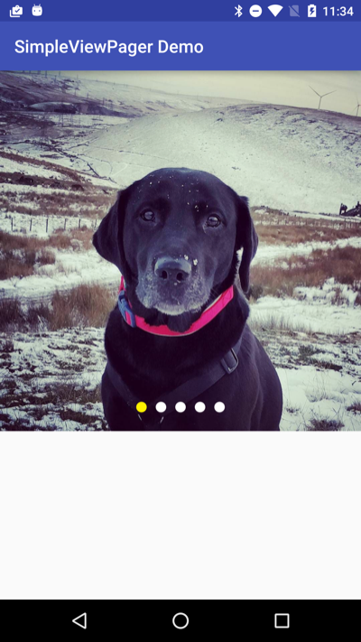

# SimpleViewPager
[](https://jitpack.io/#fiskurgit/SimpleViewPager) [](https://travis-ci.org/fiskurgit/SimpleViewPager)
[](https://github.com/fiskurgit/ChipCloud/blob/master/LICENSE) [](https://www.codacy.com/app/fiskur/SimpleViewPager?utm_source=github.com&amp;utm_medium=referral&amp;utm_content=fiskurgit/SimpleViewPager&amp;utm_campaign=Badge_Grade)

That image ViewPager you have to code for every Android project - use this instead.

Basic demo available on the Play Store:  
<a href="https://play.google.com/store/apps/details?id=eu.fiskur.simpleviewpagerdemo&utm_source=global_co&utm_medium=prtnr&utm_content=Mar2515&utm_campaign=PartBadge&pcampaignid=MKT-Other-global-all-co-prtnr-py-PartBadge-Mar2515-1"></a>

## Usage

Add to your Android layout xml:
```xml
<eu.fiskur.simpleviewpager.SimpleViewPager
    android:id="@+id/simple_view_pager"
    android:layout_width="match_parent"
    android:layout_height="wrap_content"
    />
```

Then add your images, and setup [Picasso](http://square.github.io/picasso/) ( or [Glide](https://github.com/bumptech/glide), [Fresco](https://github.com/facebook/fresco), or whatever):
```java
SimpleViewPager simpleViewPager = (SimpleViewPager) findViewById(R.id.simple_view_pager);

String[] demoUrlArray = new String[]{
        "http://fiskur.eu/apps/simpleviewpagerdemo/001.jpg",
        "http://fiskur.eu/apps/simpleviewpagerdemo/002.jpg",
        "http://fiskur.eu/apps/simpleviewpagerdemo/003.jpg",
        "http://fiskur.eu/apps/simpleviewpagerdemo/004.jpg",
        "http://fiskur.eu/apps/simpleviewpagerdemo/005.jpg",
};

//or use resources shipped with the app. eg:
/*
int[] resourceIds = new int[]{
    R.drawable.a,
    R.drawable.b,
    R.drawable.c,
    R.drawable.d,
    R.drawable.e
}
*/

simpleViewPager.setImageUrls(demoUrlArray, new ImageURLLoader() {
                @Override
                public void loadImage(ImageView view, String url) {
                    Picasso.with(MainActivity.this).load(url).into(view);
                }
            });

//optional:
int indicatorColor = Color.parseColor("#ffffff");
int selectedIndicatorColor = Color.parseColor("#fff000");
simpleViewPager.showIndicator(indicatorColor, selectedIndicatorColor);

//optional:
simpleViewPager.setScaleType(ImageView.ScaleType.FIT_XY);
```

If you're using resources that ship with your app make life easy and let Picasso handle the memory management/downsampling and use an array of resources IDs. You can also set the ScaleType for the images (or again; leave that to [Picasso in the callback](http://square.github.io/picasso/#features)).  

Add a ViewPager.OnPageChangeListener if needed: ```simpleViewPager.setOnPageChangeListener(new ViewPager.OnPageChangeListener() {...});```

Always call ```simpleViewPager.clearListeners()``` when the activity/fragment is destroyed to avoid leaks.

##Dependency

Add jitpack.io to your root build.gradle, eg:

```groovy
allprojects {
    repositories {
        jcenter()
        maven { url "https://jitpack.io" }
    }
}
```

then add the dependency to your project build.gradle:

```groovy
dependencies {
    compile fileTree(dir: 'libs', include: ['*.jar'])
    compile 'com.github.fiskurgit:SimpleViewPager:1.0.4'
}
```
You can find the latest version in the releases tab above: https://github.com/fiskurgit/SimpleViewPager/releases

More options at jitpack.io: https://jitpack.io/#fiskurgit/SimpleViewPager

##Licence

Full licence here: https://github.com/fiskurgit/SyntaxView/blob/master/LICENSE

In short:

> The MIT License is a permissive license that is short and to the point. It lets people do anything they want with your code as long as they provide attribution back to you and don’t hold you liable.


##Screenshots

